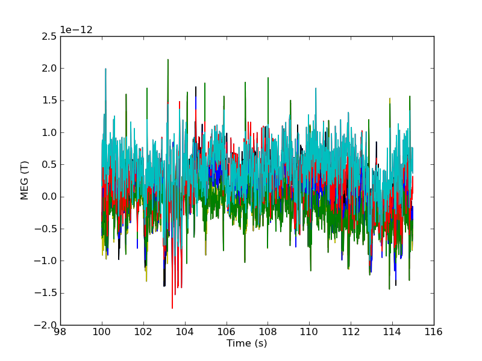
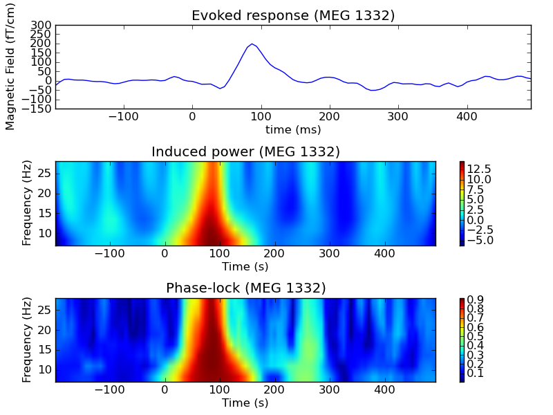
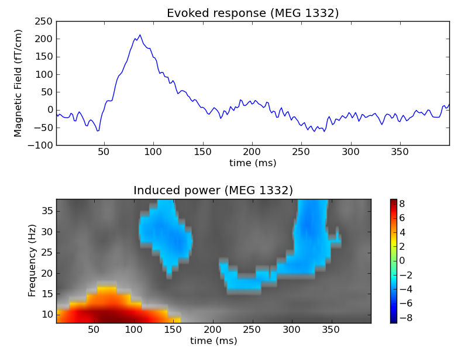
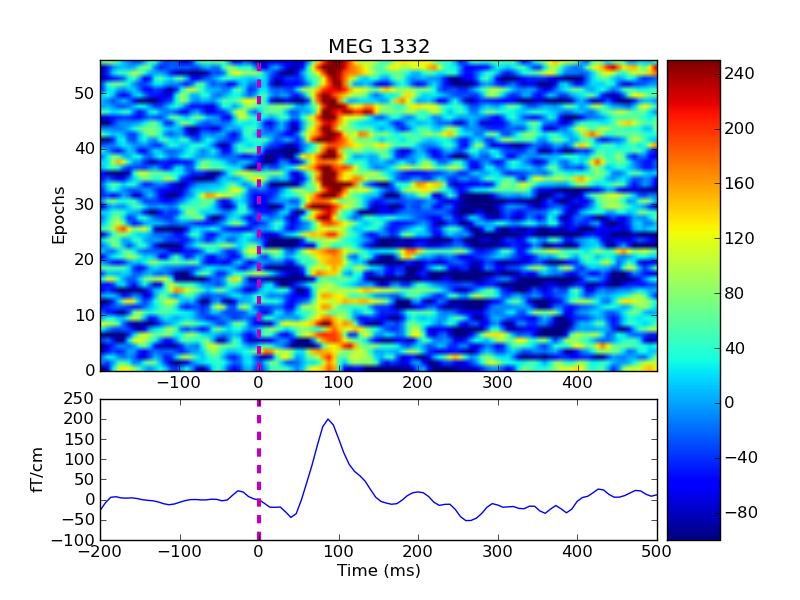
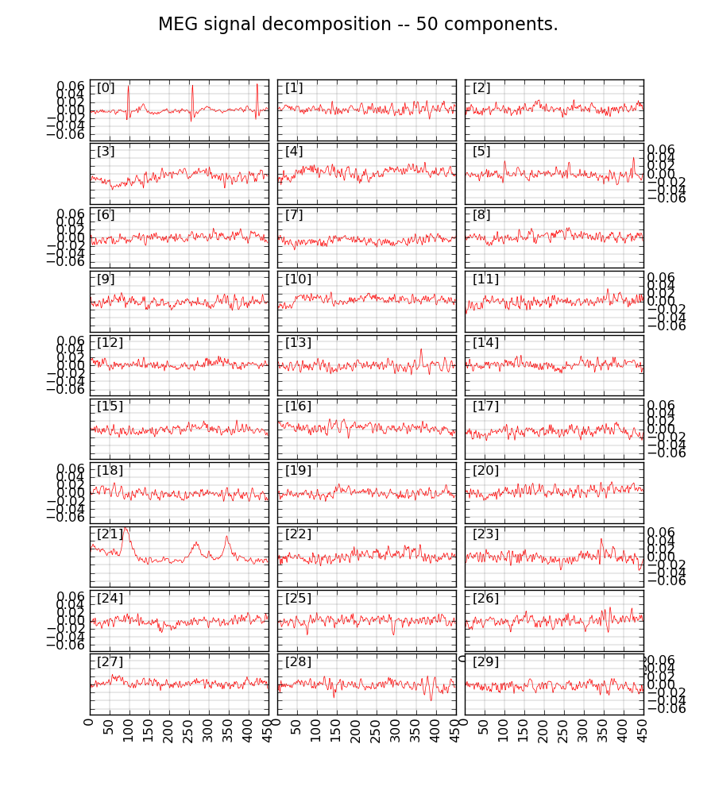

===================================================
Intro to MEG and EEG processing with MNE and Python
===================================================

**Authors:** A. Gramfort, E. Larson, M. Luessi, D. Engemann, C. M. Brodbeck, M. Hämäläinen

.. role:: input(strong)

Introduction
==============

MNE Python: The project vision
------------------------------

    - Make interacting **with MEG/EEG data** more **fun**.
    - **Open** project: very permissive BSD license, open version control system to facilitate contributions
    - The project is being maintained by a **community of labs**

    .. - KISS principle : **Keep it super simple** !
    .. - Robust software with good engineering: **tests**, **coverage** analysis, **code quality** control, emphasis on **readability** and **simplicity**

What you're not supposed to do with MNE Python
----------------------------------------------

    - **Forward modeling**: BEM computation and mesh creation (done with FreeSurfer)
    - **Interactive raw data visualization** done with *mne_browse_raw*

What you can do with MNE Python
----------------------------------------------

    - **Process raw files**: In short everything you do with *mne_process_raw* (filtering, computing SSP vectors, downsampling etc.)
    - **Independent Component Analysis**: on raw and epochs data.
    - **Epoching**: Define epochs, baseline correction, drop bad epochs, handle epochs across conditions etc.
    - **Averaging** to get Evoked data
    - **Compute contrasts** between conditions, between sensors, across subjects etc.
    - **Linear inverse solvers** (dSPM, MNE, MxNE, beamformer)
    - **Interactive MNE source estimates visualization**
    - **Time-frequency** analysis with Morlet wavelets (induced power, phase lock value) also in the source space
    - **Connectivity Estimation** visualize and analyse connectivity between sensors or between ROIs in source space.
    - **Non-parametric statistics** in time, space and frequency (including with cluster-level)
    - **Scripting** (batch and parallel computing)
    - **Export data** embedded export to other Python libraries, i.e. NiTime and Panda, using methods provided for raw, epochs, and evoked objects

.. note:: Packaged based on the FIF file format from Neuromag but can work with CTF and 4D after conversion to FIF.

Why Python?
-----------

    - Python is a real language that allows to design **clean and powerful APIs** (e.g. can be object oriented)
    - Runs on **all systems** (Linux, Mac and Windows)
    - **Free**
    - Full **control of the memory** you use for your analysis
    - **Packaging**, **software engineering tools** are shared across disciplines (not only scientific computing)
    - **Parallel** processing
    - **Caching** functions

Installation of the required materials
---------------------------------------

The Python scientific computing environment: **Numpy**, **Scipy**, also the **scikit-learn** (optional).
Numpy provides data structures (array,
matrices) and Scipy provides algorithms (linear algebra, signal processing, etc.). For parallel computing
it uses `joblib`_ shipped with the `scikit-learn`_ .

.. _joblib: http://packages.python.org/joblib/
.. _scikit-learn: http://scikit-learn.sourceforge.net/

The embedded exporters require Pandas and NiTime:

.. _pandas: http://pandas.pydata.org
.. _nitime: http://nipy.sourceforge.net/nitime/

Get the code
^^^^^^^^^^^^

  https://github.com/mne-tools/mne-python

From raw data to evoked data
============================

.. _ipython: http://ipython.scipy.org/

Now, launch `ipython`_ (Advanced Python shell)::

  $ ipython -pylab -wthread

First, load the mne package:

    >>> import mne

Access raw data
---------------

.. doctest::

    >>> from mne.datasets import sample
    >>> data_path = sample.data_path()
    >>> raw_fname = data_path + '/MEG/sample/sample_audvis_filt-0-40_raw.fif'
    >>> print raw_fname
    ./MNE-sample-data/MEG/sample/sample_audvis_filt-0-40_raw.fif

.. note:: The MNE sample dataset should be downloaded automatically but be patient (> 600MB)

Read data from file:

    >>> raw = mne.fiff.Raw(raw_fname) # doctest:+ELLIPSIS
    Opening raw data ...
    Ready.
    >>> print raw
    Raw (n_channels x n_times : 376 x 41700)

Read and plot a segment of raw data

    >>> start, stop = raw.time_to_index(100, 115)  # 100 s to 115 s data segment
    >>> data, times = raw[:, start:stop]
    Reading 21465 ... 23716  =    142.953 ...   157.945 secs...  [done]
    >>> print data.shape
    (376, 2252)
    >>> print times.shape
    (2252,)
    >>> data, times = raw[2:20:3, start:stop]  # take some Magnetometers
    Reading 21465 ... 23716  =    142.953 ...   157.945 secs...  [done]

    ## TODO plot command?

Save a segment of 150s of raw data (MEG only):

    >>> picks = mne.fiff.pick_types(raw.info, meg=True, eeg=False, stim=True)
    >>> raw.save('sample_audvis_meg_raw.fif', tmin=0, tmax=150, picks=picks) # doctest: +ELLIPSIS
    Reading ...

Define and read epochs
----------------------

First extract events:

    >>> events = mne.find_events(raw, stim_channel='STI 014')
    Reading 6450 ... 48149  =     42.956 ...   320.665 secs...  [done]
    >>> print events[:5]
    [[6994    0    2]
     [7086    0    3]
     [7192    0    1]
     [7304    0    4]
     [7413    0    2]]

Define epochs parameters and handle conditions:

    >>> event_id = dict(aud_l=1, vis_l=3)
    >>> tmin = -0.2
    >>> tmax = 0.5

Exclude some channels (bads + 2 more):

    >>> exclude = raw.info['bads'] + ['MEG 2443', 'EEG 053']

Pick the good channels:

    >>> picks = mne.fiff.pick_types(raw.info, meg=True, eeg=True, eog=True, stim=False, exclude=exclude)

Define the baseline period:

    >>> baseline = (None, 0)  # means from the first instant to t = 0

Define peak-to-peak rejection parameters for gradiometers, magnetometers and EOG:

    >>> reject = dict(grad=4000e-13, mag=4e-12, eog=150e-6)

Read epochs:

    >>> epochs = mne.Epochs(raw, events, event_id, tmin, tmax, proj=True, picks=picks, baseline=baseline, preload=False, reject=reject)
    4 projection items activated
    Created an SSP operator (subspace dimension = 4)
    72 matching events found
    >>> print epochs
    Epochs (n_events : 145 (good & bad), tmin : -0.2 (s), tmax : 0.5 (s), baseline : (None, 0))

Compute evoked auditory responses by averaging and plot it:

    >>> evoked = epochs['aud_l'].average() # doctest: +ELLIPSIS
    Reading ...
    >>> print evoked
    Evoked (comment : Unknown, time : [-0.199795, 0.492828], n_epochs : 72, n_channels x n_times : 364 x 105)
    >>> evoked.plot()

.. figure:: images/plot_read_epochs.png
    :alt: Evoked data

.. topic:: Exercise

  1. Extract the max value of each epoch

  >>> max_in_each_epoch = [e.max() for e in epochs] # doctest:+ELLIPSIS
  Reading ...
  >>> print max_in_each_epoch[:4]
  [1.9375166986930204e-05, 1.6405511048086112e-05, 1.8545375480692806e-05, 2.041281478349248e-05]

Time-Frequency: Induced power and phase-locking values
======================================================

Define parameters:

    >>> import numpy as np
    >>> n_cycles = 2  # number of cycles in Morlet wavelet
    >>> frequencies = np.arange(7, 30, 3)  # frequencies of interest
    >>> Fs = raw.info['sfreq']  # sampling in Hz

Compute induced power and phase-locking values:

    >>> data = epochs.get_data()
    >>> from mne.time_frequency import induced_power
    >>> power, phase_lock = induced_power(data, Fs=Fs, frequencies=frequencies, n_cycles=2, n_jobs=1)

Inverse modeling: MNE and dSPM on evoked and raw data
=====================================================

Import the required functions:

    >>> from mne.minimum_norm import apply_inverse, read_inverse_operator

Read the inverse operator:

    >>> fname_inv = data_path + '/MEG/sample/sample_audvis-meg-oct-6-meg-inv.fif'
    >>> inverse_operator = read_inverse_operator(fname_inv) # doctest: +ELLIPSIS
    Reading ...

Define the inverse parameters:

    >>> snr = 3.0
    >>> lambda2 = 1.0 / snr ** 2
    >>> dSPM = True

Compute the inverse solution:

    >>> stc = apply_inverse(evoked, inverse_operator, lambda2, dSPM) # doctest:+ELLIPSIS
    Preparing the inverse operator for use ...

Save the source time courses to disk:

    >>> stc.save('mne_dSPM_inverse')
    Writing STC to disk... [done]

Now, let's compute dSPM on a raw file within a label:

    >>> fname_label = data_path + '/MEG/sample/labels/Aud-lh.label'
    >>> label = mne.read_label(fname_label)

Compute inverse solution during the first 15s:

    >>> from mne.minimum_norm import apply_inverse_raw
    >>> start, stop = raw.time_to_index(0, 15)  # read the first 15s of data
    >>> stc = apply_inverse_raw(raw, inverse_operator, lambda2, dSPM, label, start, stop) # doctest:+ELLIPSIS
    Preparing the inverse operator for use ...

Save result in stc files:

    >>> stc.save('mne_dSPM_raw_inverse_Aud')
    Writing STC to disk... [done]

What else can you do?
=====================

    - plot and analyze connectivity in sensor and source space
    - plot time frequency representations for all channels on sensor layout
    - plot time epochs images for all channels on sensor layout to visualize cross-trial response dynamics
    - decompose and automatically identify latent sources using ICA
    - sensor space analyses in ICA space
    - morph stc from one brain to another for group studies
    - interactively visualize source estimates
    - estimate power in the source space
    - estimate noise covariance matrix from Raw and Epochs
    - detect heart beat QRS component
    - detect eye blinks and EOG artifacts

What comes next?
================

    - frequency domain beamformers (e.g. DICS)
    - improved M/EEG data simulation utilities
    - band-stop and notch-filters for removal of power line artifacts 
    - GLM framework for improved analysis of factorial experimental designs
    - improved support for other MEG systems 
    - anything you want to contribute for the community !

Some screen shots
=================

.. figure:: images/plot_topography.png
    :alt: 2D toprography

    2D toprography

.. figure:: images/plot_topo_conditions_example.png
	:alt: Compare conditions across channels

	Compare conditions across channels

    Cluster level stat in time frequency decomposition

.. figure:: images/cluster_full_layout_c0-c1.png
    :alt: Topography of cluster level stat in time

    Topography of cluster level stat in time

.. figure:: images/cwt_sensor_connectivity.png
	:alt: Sensor space connectivity

	Sensor space connectivity

    Cross-trial response dynamics

	
	Independent Component Analysis

Want to know more ? Go to `martinos.org/mne`_ and browse `examples`_ gallery
============================================================================

.. _martinos.org/mne: http://www.martinos.org/mne
.. _examples: https://martinos.org/mne/auto_examples/index.html

